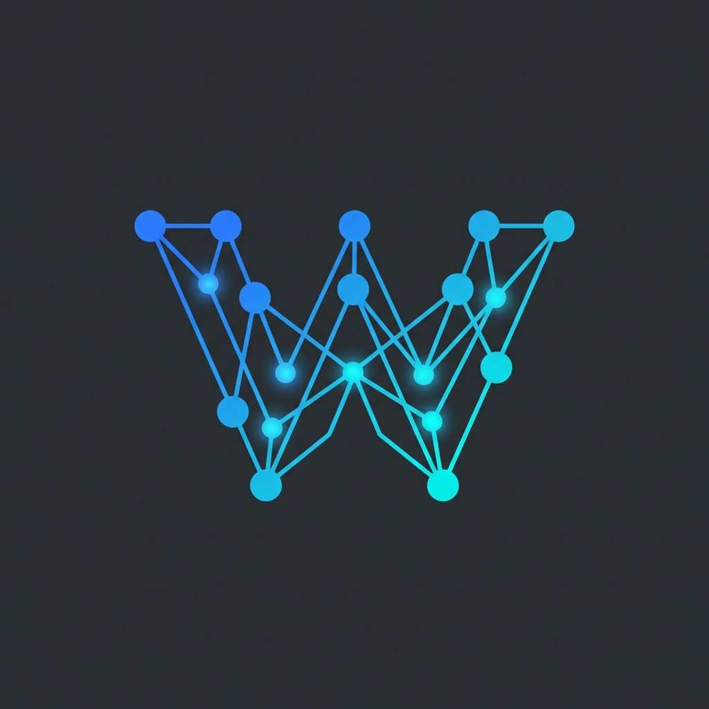

<p align="center">
  
</p>

<h1 align="center">WinnowDB</h1>

<p align="center">
  <strong>High-Performance Vector Database for JavaScript</strong><br>
  <em>Built in Rust. Powered by WebAssembly. Works everywhere.</em>
</p>

<p align="center">
  <a href="https://www.npmjs.com/package/winnow-db"></a>
  <a href="LICENSE"></a>
  
  
</p>

---

## ⚡ 30-Second Start

```bash
npm install winnow-db
```

```javascript
import init, { WinnowCollection } from 'winnow-db';

await init();

const db = new WinnowCollection("vectors", {
    dim: 128,
    index_type: "HNSW",
    max_elements: 10000
}, null);

db.add(1, embedding, null, null, '{"title": "Hello"}');
const results = db.search(query, 10, null, null);
```

## 🎯 Why WinnowDB?

| | WinnowDB | Pinecone | Weaviate | ChromaDB |
|:--|:--:|:--:|:--:|:--:|
| **Runs in Browser** | ✅ | ❌ | ❌ | ❌ |
| **No Server Required** | ✅ | ❌ | ❌ | ❌ |
| **Offline Support** | ✅ | ❌ | ❌ | ✅ |
| **Open Source** | ✅ | ❌ | ✅ | ✅ |
| **Privacy-First** | ✅ | ❌ | ❌ | ✅ |

## 📊 Performance

| Vectors | Insert | Search | Latency |
|---------|--------|--------|---------|
| 1,000 | 4,300/s | 20,000 qps | 0.05ms |
| 10,000 | 2,000/s | 13,000 qps | 0.08ms |
| 100,000 | 800/s | 5,000 qps | 0.2ms |

## 💡 Use Cases

- **🤖 RAG** - Retrieval-Augmented Generation without API calls
- **🔍 Search** - Semantic document/product search
- **🎯 Recommendations** - Find similar items/users
- **🖼️ Image Search** - Visual similarity with CLIP embeddings
- **📱 Offline Apps** - Mobile apps that work without internet

## 📦 API

### Create Collection

```javascript
const db = new WinnowCollection(name, config, null);
```

Config options:

- `dim` - Vector dimension (required)
- `index_type` - "HNSW", "IVFPQ", "SQ", "BQ"
- `max_elements` - Maximum capacity
- `m` - HNSW connections (default: 16)
- `ef_construction` - Build quality (default: 100)

### CRUD Operations

```javascript
db.add(id, vector, null, null, payload)     // Insert
db.delete(id)                                // Delete
db.exists(id)                                // Check
db.count()                                   // Count
db.get_payload(id)                           // Get metadata
db.update_payload(id, json)                  // Update
db.clear()                                   // Clear all
```

### Search

```javascript
// Basic
const results = db.search(query, k, null, null);

// With filter
const results = db.search(query, 10, { category: "tech" }, null);

// Returns: [[id, distance], ...]
```

### Persistence

```javascript
// Save
const bytes = db.snapshot();
localStorage.setItem('db', btoa(String.fromCharCode(...bytes)));

// Load
const db = WinnowCollection.load_snapshot(bytes, null);
```

## 🧪 Examples

```bash
# Node.js quickstart
node examples/node-quickstart/index.mjs

# Semantic search
node examples/semantic-search/index.mjs

# Benchmark
node examples/benchmark/index.mjs
```

See [examples/README.md](./examples/README.md) for more.

## 🌐 Browser Usage

```html
<script type="module">
import init, { WinnowCollection } from 'winnow-db';
await init();
// Same API as Node.js!
</script>
```

## 📄 License

MIT - see [LICENSE](./LICENSE)
